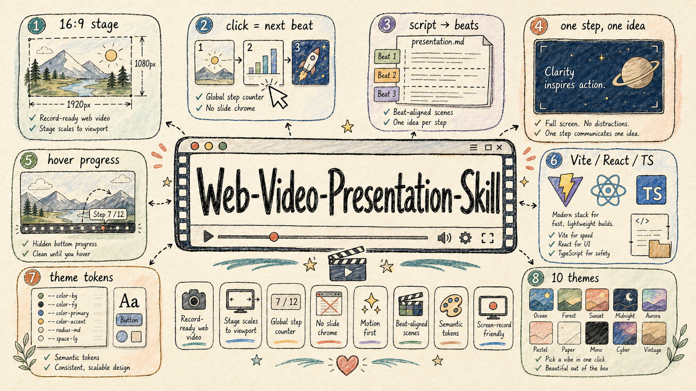
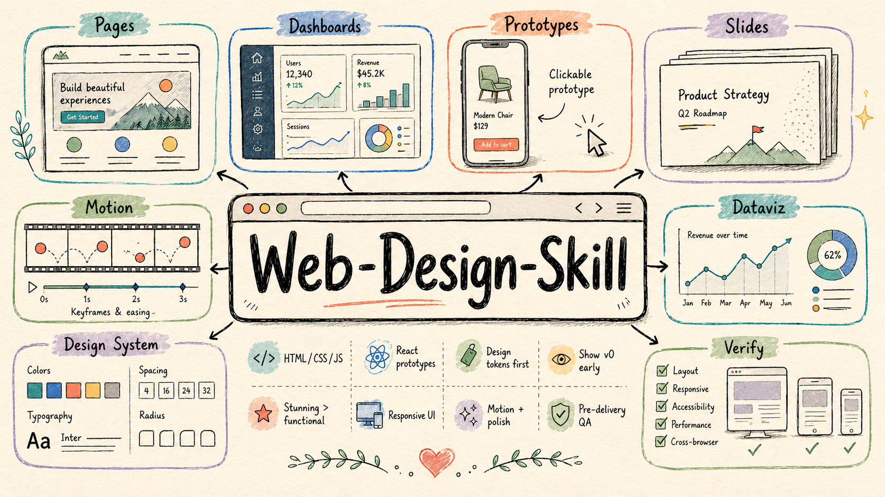
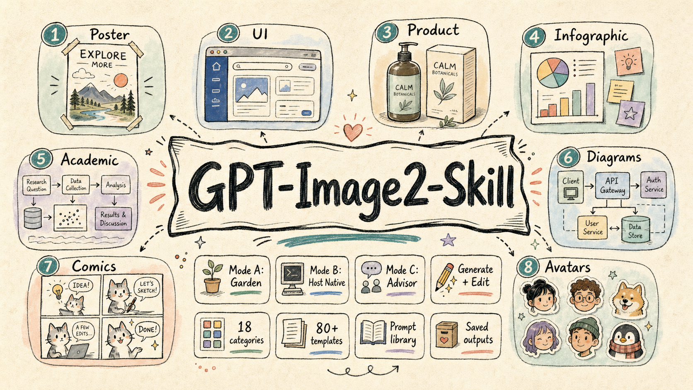
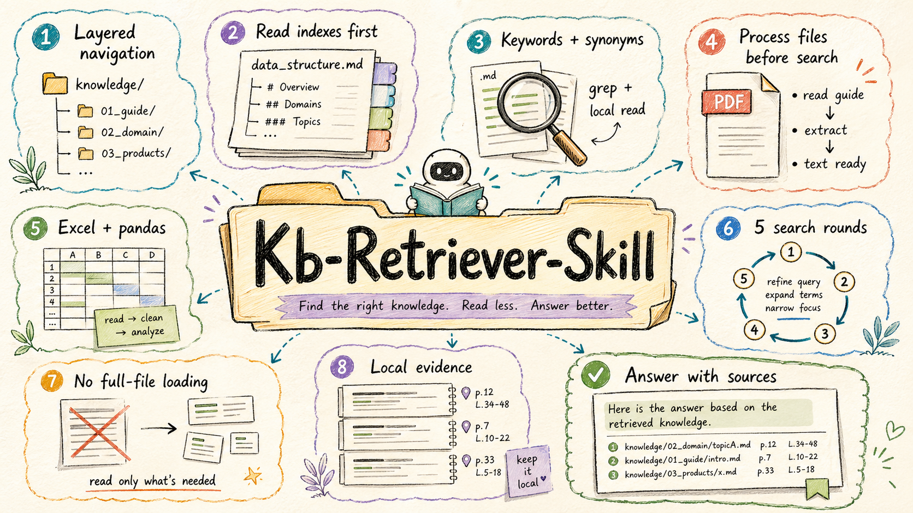

<div align="center">

# Garden Skills

**花園老師的開源 [Agent Skills](https://support.claude.com/en/articles/12512176-what-are-skills) 集合，面向 Claude Code、Cursor、Codex 等所有支援 `SKILL.md` 格式的 AI 程式設計代理。**

<a id="skills-gallery"></a>

<table>
<tr>
<td width="50%" valign="top">
<a href="#web-video-presentation"></a>
<br/><a href="#web-video-presentation"><strong>web-video-presentation</strong></a>
<br/><sub>網頁影片 / 簡報演示專案</sub>
</td>
<td width="50%" valign="top">
<a href="#web-design-engineer"></a>
<br/><a href="#web-design-engineer"><strong>web-design-engineer</strong></a>
<br/><sub>設計 / 前端</sub>
</td>
</tr>
<tr>
<td width="50%" valign="top">
<a href="#gpt-image-2"></a>
<br/><a href="#gpt-image-2"><strong>gpt-image-2</strong></a>
<br/><sub>影像生成 / Prompt</sub>
</td>
<td width="50%" valign="top">
<a href="#kb-retriever"></a>
<br/><a href="#kb-retriever"><strong>kb-retriever</strong></a>
<br/><sub>本機知識庫檢索</sub>
</td>
</tr>
</table>

[](./LICENSE)
[](https://github.com/ConardLi/garden-skills/stargazers)
[](#貢獻)
[](#skills-gallery)
[](https://agentskills.io)

[English](./README.md) · [中文文件](./README.zh-CN.md) · [日本語](./README.ja-JP.md)

</div>

---

## 目錄

| 安裝 | 使用 | 參與共建 |
|---|---|---|
| [安裝](#安裝)<br>[`skills` CLI（npx）](#方式-a--skills-clinpx)<br>[Claude Code 外掛市場](#方式-b--claude-code-外掛市場)<br>[Releases 鎖定版本 `.zip`](#方式-c--releases-鎖定版本-zip)<br>[手動拷貝](#方式-d--手動拷貝到專案)<br>[Git Submodule](#方式-e--git-submodule) | [相容性](#相容性)<br>[什麼是 Skill？](#什麼是-skill) | [貢獻](#貢獻)<br>[致謝](#致謝)<br>[授權條款](#授權條款) |

---

### [`web-video-presentation`](./skills/web-video-presentation)


**類別：** 網頁影片 / 簡報演示專案  
**適合：** 把口播稿、文章、課程、產品演示和 talk 做成影片（網頁模擬）。

`web-video-presentation` 用於建構適合錄影的 Vite + Angular + TypeScript 簡報。它會把原始文章轉成口播稿，把口播節拍對應成全螢幕視覺 step，在關鍵節點暫停讓使用者確認，並可在視覺大綱（outline）確認後選擇性合成口播音訊。

亮點：

- 固定 1920×1080 舞台，並按視窗大小縮放，適合穩定錄影
- 點擊 / 鍵盤驅動 `(chapter, step)` 游標，一個口播節拍對應一個視覺 step
- 在稿子、主題、大綱、開發模式和可選音訊合成前設置強檢查點（checkpoint）
- 懸浮才出現的進度控制，錄影時畫面保持乾淨
- 基於主題 token 的視覺架構，內建 **23 套主題**，每套獨立設計風格，覆蓋編輯器、終端機、工程、瑞士國際主義等多種風格
- **可插拔 TTS**：獨立於供應商（provider-agnostic）的音訊執行器，**內建 2 個 provider**（MiniMax `mmx-cli` + OpenAI TTS via curl），並附帶三函數契約 + ElevenLabs / edge-tts / Azure / Google Cloud / macOS `say` 的現成程式碼片段
- 腳手架產出 Vite + Angular + TypeScript 專案，並附帶舞台原語與錄影指南

連結：[README](./skills/web-video-presentation/README.zh-CN.md) · [SKILL.md](./skills/web-video-presentation/SKILL.md) · <!-- DOWNLOAD:web-video-presentation:start -->[下载 v1.2.1 .zip](https://github.com/ConardLi/garden-skills/releases/download/web-video-presentation-v1.2.1/web-video-presentation-1.2.1.zip)<!-- DOWNLOAD:web-video-presentation:end -->

---

### [`web-design-engineer`](./skills/web-design-engineer)


**類別：** 設計 / 前端  
**適合：** 網頁、落地頁、儀表板、互動原型、HTML 投影片、動畫、UI 樣機、資料視覺化和設計系統探索。

`web-design-engineer` 把 AI 生成的 Web 產物從「能用」推進到「精緻、克制、真正有設計判斷」。它把 Agent 當作設計工程師來約束：先理解產品上下文，再宣告設計系統，儘早展示 v0，然後完整建構並驗證結果。

亮點：

- 定義六步設計工作流：需求 → 上下文 → 設計系統 → v0 → 完整建構 → 驗證
- 用反 AI 俗套清單和更強的視覺判斷，避免千篇一律的生成式 UI
- 內建 **設計方向顧問（6 學派差異化推薦）+ 25 套有 anchor 的風格配方庫**（Linear / Aesop / Pentagram / Bloomberg / Stripe Press / Mid-Century 等），含可貼上的 palette / typography / signature moves / 反模式
- 覆蓋 HTML / CSS / JavaScript / React 原型，以及響應式版面配置、動效和互動細節
- 包含 inline React + Babel、CSS tokens、`oklch()` 配色、container queries、reduced-motion 等實作規則
- 提供高階模式參考，覆蓋設備框、投影片引擎、動畫時間軸、儀表板等常見 Web 產物

連結：[README](./skills/web-design-engineer/README.zh-CN.md) · [SKILL.md](./skills/web-design-engineer/SKILL.md) · [Website](./website/web-design-website) · [Demo](./demo/web-design-demo) · <!-- DOWNLOAD:web-design-engineer:start -->[下载 v1.2.0 .zip](https://github.com/ConardLi/garden-skills/releases/download/web-design-engineer-v1.2.0/web-design-engineer-1.2.0.zip)<!-- DOWNLOAD:web-design-engineer:end -->

---

### [`gpt-image-2`](./skills/gpt-image-2)


**類別：** 影像生成 / Prompt 工程  
**適合：** 海報、UI 樣機、產品圖、資訊圖、學術圖、技術架構圖、漫畫、頭像、分鏡、品牌板和影像編輯工作流。

`gpt-image-2` 是面向 GPT Image 2 與 OpenAI 相容影像介面的聚焦型影像生成 Skill。它能適配不同 Agent 環境：Garden 本地完整出圖、委託宿主原生影像工具、或在沒有影像工具時退化為純提示詞顧問。

亮點：

- 支援三種執行模式：**Mode A Garden 本地生圖**、**Mode B 委託宿主出圖**、**Mode C 純提示詞顧問**
- 每次任務先做模式偵測，避免靜默走錯執行路徑
- 在 `references/` 下提供 18 大類、80+ 個結構化提示詞範本
- 同時覆蓋影像生成和影像編輯，並配套專門工作流與指令碼
- Garden 模式下會把 prompt 與生成圖片儲存到 `garden-gpt-image-2/`，方便複用、審查和版本管理

連結：[README](./skills/gpt-image-2/README.zh-CN.md) · [SKILL.md](./skills/gpt-image-2/SKILL.md) · [Website](./website/gpt-image2-website) · <!-- DOWNLOAD:gpt-image-2:start -->[下载 v1.0.3 .zip](https://github.com/ConardLi/garden-skills/releases/download/gpt-image-2-v1.0.3/gpt-image-2-1.0.3.zip)<!-- DOWNLOAD:gpt-image-2:end -->

---

### [`kb-retriever`](./skills/kb-retriever)


**類別：** 檢索 / 本地知識庫  
**適合：** 從本地 `knowledge/` 目錄回答問題，檢索結構化文件，並在不撐爆上下文的前提下從 Markdown、文字、PDF、Excel 中提取證據。

`kb-retriever` 是一個本地知識庫檢索 Skill，核心是謹慎、漸進、可溯源。它不會直接載入整個檔案，而是先走分層索引，縮小候選範圍，按檔案類型正確處理，再帶來源回答問題。

亮點：

- 透過分層 `data_structure.md` 檔案先導覽知識庫，再進入內容檢索
- 對 PDF 和 Excel 強制執行 **先學習再處理**，必須先閱讀內建 reference 文件
- 組合關鍵字檢索、局部視窗讀取、同義詞擴充和多輪反覆運算
- 最多 5 輪檢索，讓探索過程有邊界
- 內建 `grep`、`pdftotext`、`pdfplumber`、`pandas` 工作流，並強調答案來源

連結：[README](./skills/kb-retriever/README.zh-CN.md) · [SKILL.md](./skills/kb-retriever/SKILL.md) · <!-- DOWNLOAD:kb-retriever:start -->[下载 v1.0.0 .zip](https://github.com/ConardLi/garden-skills/releases/download/kb-retriever-v1.0.0/kb-retriever-1.0.0.zip)<!-- DOWNLOAD:kb-retriever:end -->

---

## 安裝

總共支援 5 種安裝方式，按你的工作流程選一個即可：

| # | 方式 | 適合場景 | 能鎖定版本？ |
|---|---|---|---|
| A | [`skills` CLI（`npx skills add`）](#方式-a--skills-clinpx) | 任意 Agent，一行指令，可挑選單個 Skill | ✅ 透過 tag URL |
| B | [Claude Code 外掛市場](#方式-b--claude-code-外掛市場) | Claude Code 使用者、訂閱外掛包 | ✅ 透過市場版本 |
| C | [Releases 鎖定版本 `.zip`](#方式-c--releases-鎖定版本-zip) | CI / 內網 / 可複現安裝 | ✅ ✅（不可變） |
| D | [`git clone` 後手動拷貝](#方式-d--手動拷貝到專案) | 本地 hack / 想自己魔改 | ❌（跟隨 `main`） |
| E | [Git Submodule](#方式-e--git-submodule) | 嵌進更大專案，需要隨上游升級 | ✅ 透過 submodule SHA |

> 上面每個 Skill 的"連結"那一行末尾，都有一個 **`下載 v<版本> .zip`** 連結，
> 指向該 Skill 目前的鎖定版本發佈產物。這些 URL 由
> [`scripts/release/update-readme.mjs`](./scripts/release/update-readme.mjs)
> 在每次發版後自動重寫，永遠指向最新的不可變版本。

### 方式 A · `skills` CLI（npx）

最快的、跨 Agent 通用的方式。直接使用社群標準的
[`npx skills` CLI](https://www.npmjs.com/package/skills)，它會自動識別你正在用
的 Agent（Claude Code / Cursor / Codex / …）並把 Skill 放到對的目錄。

```bash
# 一次裝上整個倉庫（4 個 Skill），最新
npx skills add ConardLi/garden-skills

# 只裝某一個 Skill，最新
npx skills add ConardLi/garden-skills -s web-design-engineer

# 裝到全域 (~/.skills) 而不是當前專案 (./.skills)
npx skills add ConardLi/garden-skills -s gpt-image-2 --global

# 指定目標 Agent
npx skills add ConardLi/garden-skills -s kb-retriever -a claude-code
```

> **預設就是 `main` 上的最新版本**，95% 的場景這就是你想要的——CLI 直接從原始碼
> 樹拉每個 Skill 當前的 `SKILL.md`。

**想鎖定版本？（CI / 生產環境）** 用帶 tag 的 `tree/` URL，會指向某次 release
對應的那次提交：

```bash
# 把某個 Skill 鎖定到具體的 release
npx skills add ConardLi/garden-skills/tree/web-design-engineer-v1.0.0/skills/web-design-engineer
```

每個 Skill 目前的鎖定版本 `.zip` URL 也直接掛在了上面"連結"那一行末尾的
`下載 v<版本> .zip` 連結裡。

常用子指令：

```bash
npx skills list                 # 看已安裝了什麼
npx skills find web-design      # 在倉庫內搜尋
npx skills update               # 全部升級
npx skills remove kb-retriever  # 卸載
```

### 方式 B · Claude Code 外掛市場

如果你用 [Claude Code](https://docs.anthropic.com/en/docs/claude-code)，可以
訂閱外掛市場，按"包"安裝一組相關的 Skill：

```bash
/plugin marketplace add ConardLi/garden-skills
/plugin install presentation-skills@garden-skills
/plugin install web-design-skills@garden-skills
/plugin install knowledge-base-skills@garden-skills
/plugin install image-generation-skills@garden-skills
```

外掛包定義在 [`.claude-plugin/marketplace.json`](./.claude-plugin/marketplace.json)：

| 外掛包 | 包含的 Skills |
|---|---|
| `presentation-skills` | `web-video-presentation` |
| `web-design-skills` | `web-design-engineer` |
| `knowledge-base-skills` | `kb-retriever` |
| `image-generation-skills` | `gpt-image-2` |

### 方式 C · Releases 鎖定版本 `.zip`

每次正式發版都會把對應 Skill 打包成一個**不可變**的 `.zip`（附帶
SHA-256 校驗檔案）發到
[GitHub Releases](https://github.com/ConardLi/garden-skills/releases)。
適合 CI、Dockerfile、內網部署等需要"位元組級可複現"的場景。

```bash
# 把 <skill> / <version> 替換成你要的版本即可
SKILL=web-design-engineer
VERSION=1.0.0

curl -fsSL -o "${SKILL}.zip" \
  "https://github.com/ConardLi/garden-skills/releases/download/${SKILL}-v${VERSION}/${SKILL}-${VERSION}.zip"

# 校驗 SHA-256（無人值守安裝時強烈建議）
curl -fsSL -o "${SKILL}.zip.sha256" \
  "https://github.com/ConardLi/garden-skills/releases/download/${SKILL}-v${VERSION}/${SKILL}-${VERSION}.zip.sha256"
shasum -a 256 -c "${SKILL}.zip.sha256"

# 解壓縮到 Agent 的 skills 目錄
unzip -q "${SKILL}.zip" -d .claude/skills/   # 或 .agents/skills/、.codex/skills/ 等
```

如果你只想"永遠拿最新"，也有一個跟著最近一次 release 走的 URL：

```bash
https://github.com/ConardLi/garden-skills/releases/latest/download/<skill>-<version>.zip
```

> **每個 Skill 目前版本的鎖定版本 URL 都直接列在 README 裡**——見上面每個 Skill
> 區塊"連結"那一行下面的"下載"塊。這些連結由發佈流水線自動同步。

### 方式 D · 手動拷貝到專案

`git clone` 整倉後再拷貝你要的 Skill。適合本地 fork、二次開發場景：

```bash
git clone https://github.com/ConardLi/garden-skills.git
cp -r garden-skills/skills/web-design-engineer  your-project/.claude/skills/
# Cursor / 通用 Agent：
cp -r garden-skills/skills/web-design-engineer  your-project/.agents/skills/
```

Agent 在下次掃描工作區時會自動發現。

### 方式 E · Git Submodule

如果你想在更大的專案裡把本倉庫作為依賴來跟蹤上游更新：

```bash
git submodule add https://github.com/ConardLi/garden-skills.git vendor/garden-skills
ln -s ../../vendor/garden-skills/skills/web-design-engineer .claude/skills/web-design-engineer
```

為了可複現，建議把 submodule 鎖定到某個 release tag：

```bash
cd vendor/garden-skills
git checkout web-design-engineer-v1.0.0
```

---

## 相容性

| Agent / Runtime | Skill 路徑 | 狀態 |
|---|---|---|
| **Claude Code** | `.claude/skills/<name>/` 或走外掛市場 | ✅ 已驗證 |
| **Claude.ai**（網頁端） | Settings → Capabilities → Skills | ✅ 已驗證 |
| **Cursor** | `.agents/skills/<name>/` | ✅ 已驗證 |
| **Codex CLI** | `.codex/skills/<name>/` | ✅ 已驗證 |
| **Gemini CLI** | extension manifest | ✅ 已驗證 |
| **OpenCode** | `.opencode/skills/<name>/` | ✅ 已驗證 |

> `SKILL.md` 格式本身是可移植的——只要你的 Agent 支援 Skill 體系，把資料夾放進它掃描的目錄就行。歡迎 PR 擴充這張表。

---

## 什麼是 Skill？

**Skill** 就是 Agent 可以按需載入的一個自包含資料夾。它的核心是一個
`SKILL.md`（YAML frontmatter + 指令），按需配上 reference 文件、指令碼和素材：

```text
<skill-name>/
├── SKILL.md      ← 必需：什麼時候用 + 怎麼用
├── README.md     ← 讓人看的文檔
├── references/   ← 可選：Agent 按需載入的擴充文件
├── scripts/      ← 可選：確定性的可執行程式碼
└── assets/       ← 可選：範本、字體、圖示等
```

Agent 會根據 frontmatter 裡的 `description` 決定要不要啟用這個 Skill——
所以 description 就是你和 Agent 之間的契約。完整規範見
[agentskills.io](https://agentskills.io) 與
[Anthropic 官方範例倉庫](https://github.com/anthropics/skills)。

---

## 貢獻

歡迎提 issue、貢獻新的 Skill、或者改進發版工具鏈。

維護者向的文件——倉庫結構、發版流程、版本號規則、CI 工作流程、常見問題——
都在 [**`CONTRIBUTING.zh-CN.md`**](./CONTRIBUTING.zh-CN.md)
（[English](./CONTRIBUTING.md)）。新增 Skill 或者發版前先讀那份。

快速上手：

```bash
git clone https://github.com/ConardLi/garden-skills.git
cd garden-skills
npm run list      # 列出所有 Skill + manifest 狀態
npm run validate  # 跑一遍和 PR CI 完全一樣的檢查
```

---

## 致謝

本集合站在以下工作的肩膀上：

- **[Anthropic](https://www.anthropic.com)** —— [Agent Skills 規範](https://agentskills.io) 和 [`anthropics/skills`](https://github.com/anthropics/skills) 參考倉庫。
- **[Claude Design](https://www.anthropic.com/news/claude-design-anthropic-labs)** —— `web-design-engineer` 的靈感來源，原系統提示詞保留在 [`dist/prompt/claude-design-system-prompt.md`](./dist/prompt/claude-design-system-prompt.md) 供參考。
- 更廣義的 OSS Skill 社群——延伸閱讀：[`travisvn/awesome-claude-skills`](https://github.com/travisvn/awesome-claude-skills) 和 [`obra/superpowers`](https://github.com/obra/superpowers)。

---

## 授權條款

[MIT](./LICENSE) © [ConardLi](https://github.com/ConardLi)
